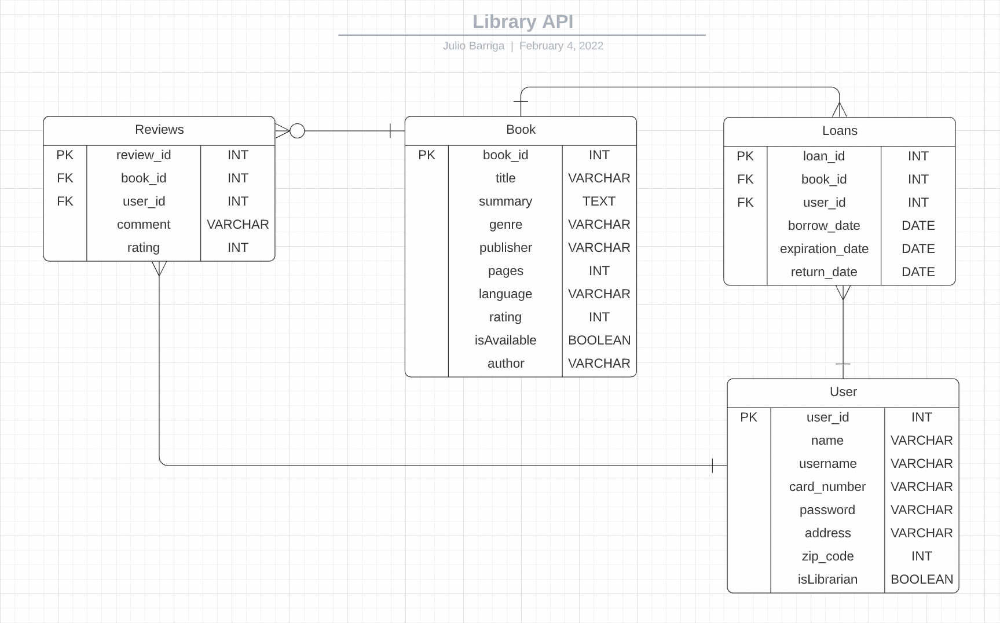
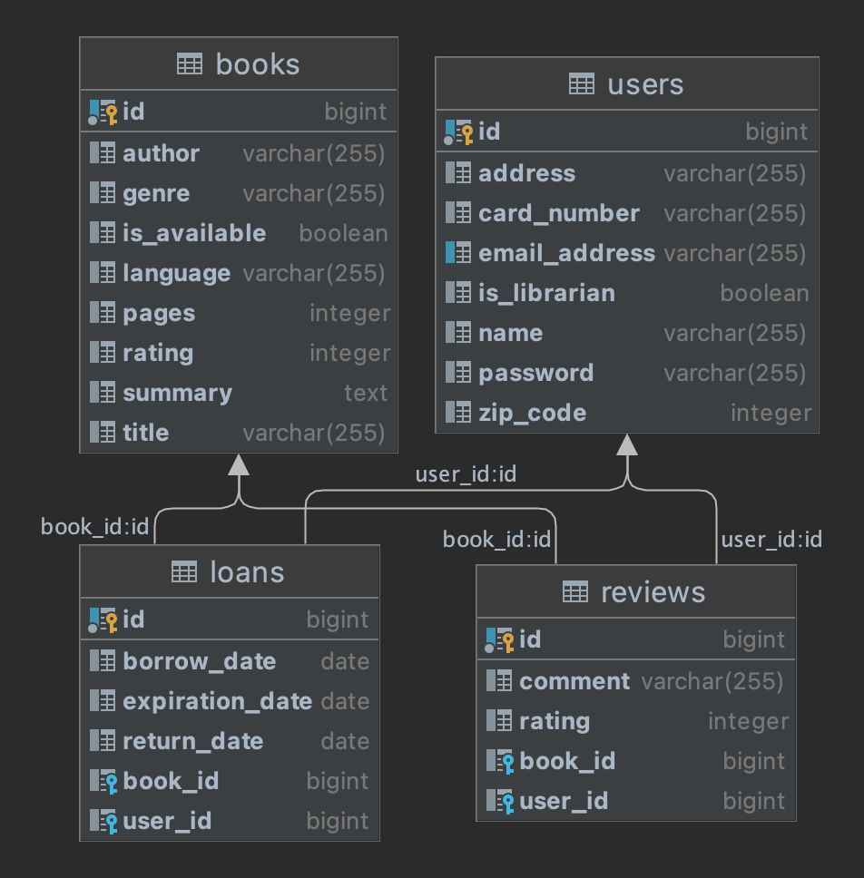

# Library_API

## User stories
### Librarian
- As a librarian, I want to add a new book so that users can have more book options to choose from.
- As a librarian, I want to edit book's information so that Its information is updated.
- As a librarian, I want to delete a book so that users know if a book is no longer in our inventory.
- As a librarian, I want to see all the loan history so that I can see who and how many times a book has been loaned.
- As a librarian, I want to loan a book so that I can take it home and read it.
- As a librarian, I want to search a loan by loan id so that I can see dates, book and user that borrowed the book.
- As a librarian, I want to search a loan by the user id so that I can see when and what books a user has borrowed.
- As a librarian, I want to search a loan by book id so that I can see dates and users that have borrowed the book.
- As a librarian, I want to edit a loan information so that I can edit the dates of the loan.
- As a librarian, I want to delete a loan so that I can cancel a loan a user made by accident.

### Librarian/ Registered user
- As a librarian/registered user, I want to loan a book so that I can take it home and read it.
- As a librarian/registered user, I want to review a book so that I can rate it and give my opinion about it.
- As a librarian/registered user, I want to edit my review so that I can change my comment or rating.
- As a librarian/registered user, I want to delete my review so that I can delete my review and don't affect the overall book rating.
- As a librarian/registered user, I want to log in into the system so that I can be granted access to certain services.

### Registered user
- As a registered user, I want to return a book so that the return date of the loan gets updated and the book status to available.
- As a registered user, I want to extend the expiration date of my loan so that I can keep the book for more days.
- As a registered user, I want to see my loan history so that I can see what books and when I borrowed them and returned them.
- As a registered user, I want to search a loan by book id so that I can see how many times I've borrowed a single book.
- As a registered user, I want to search a loan by loan id so that I can see just one particular loan entry.

### Any user (even non registered)
- As any user, I want to see the whole inventory of books so that I can choose what book to borrow.
- As any user, I want to search a book by id, so that I can see more information about it.
- As any user, I want to see all the book reviews do that I can see what other people think about them.
- As any user, I want to filter reviews by book id, so that I can see the ratings and comments that other users have about the book.
- As any user, I want to filter reviews by id, so that I can search for a particular review.
- As any user, I want to filter reviews by user id so that I can see what books a user has reviewed.
- As any user, I want to create a new library account so that I can loan books and review them.
- As any user, I want to create a new Librarian account so that I can work at the library and have more access to the inventory.

## Entity Relationship Diagram (ERD)

## End-points
| Request Type | URL                                | Functionality                           | Access  |
|--------------|------------------------------------|-----------------------------------------|---------|
| GET          | /api/books/                        | Lists all books                         | Public  |
| POST         | /api/books/                        | Adds a new book                         | Private |
| GET          | /api/books/{bookId}                | Gets a book by book ID                  | Public  |
| PUT          | /api/books/{bookId}                | Updates book information by book ID     | Private |
| DELETE       | /api/books/{bookId}                | Deletes a book by book ID               | Private |
| GET          | /api/reviews/                      | Lists all reviews                       | Public  |
| GET          | /api/reviews/books/{bookID}/       | Lists all reviews by book ID            | Public  |
| POST         | /api/reviews/books/{bookID}/       | Adds a new review by book ID            | Private |
| GET          | /api/reviews/{reviewId}/           | Gets a review by reviewId               | Public  |
| GET          | /api/reviews/users/{userId}        | Lists all reviews by user ID            | Public  |
| PUT          | /api/reviews/{reviewId}            | Updates a review by review ID           | Private |
| DELETE       | /api/reviews/{reviewId}            | Deletes a review by review ID           | Private |
| GET          | /api/loans/                        | Lists all loans                         | Private |
| POST         | /api/loans/                        | Creates a new loan entry                | Private |
| GET          | /api/loans/{loanId}                | Gets a loan entry by loan ID            | Private |
| GET          | /api/loans/{loanId}/users/{userId} | Gets a loan entry by user ID            | Private |
| GET          | /api/loans/{loanId}/books/{bookId} | Gets a loan entry by book ID            | Private |
| PUT          | /api/loans/{loanId}/               | Updates a loan entry by loan ID         | Private |
| DELETE       | /api/loans/{loanId}/               | Deletes a loan entry by loan ID         | Private |
| POST         | /auth/users/register/              | Registers a new user                    | Public  |
| POST         | /auth/users/login/                 | Logs a user in                          | Public  |
| PUT          | /auth/users/update/                | Updates user information                | Public  |
